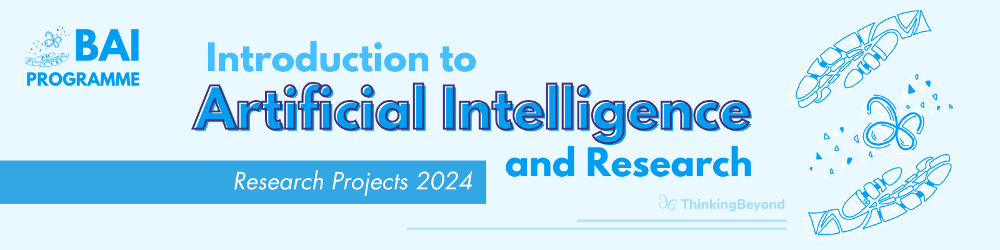

# Comparative Analysis of ODE Solvers: Accuracy and Performance Evaluation

Provide a description of your project including 

# 1. motivating your research question
# 2. stating your research question
# 3. Method and implementation
# 4. Results
# 5. Conclusions

> The research poster for this project can be found in the [BeyondAI Proceedings 2024](https://thinkingbeyond.education/beyondai_proceedings_2024/).
